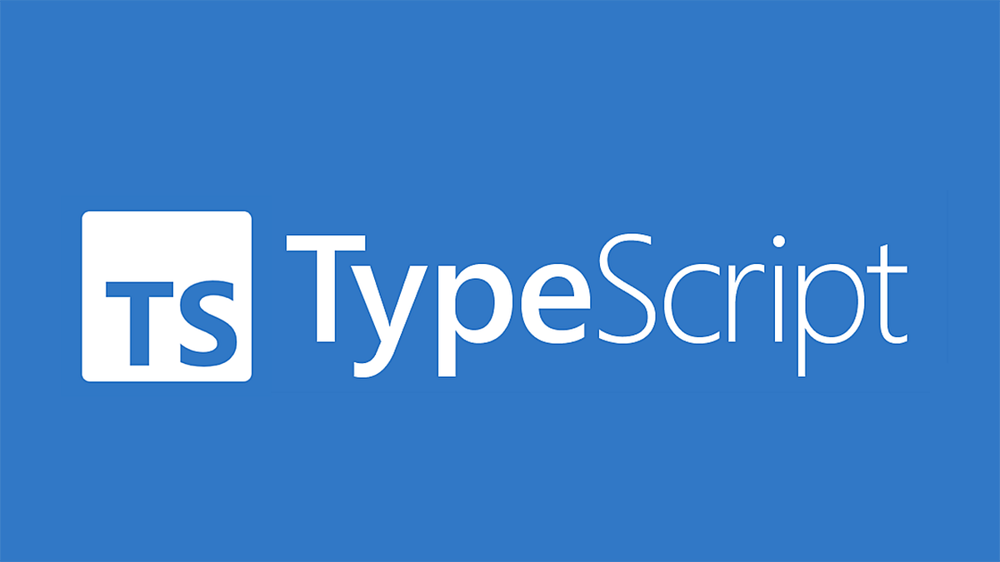

*First Impressions of TypeScript and Athletic Software Engineering*

Coming into this module, I had no prior experience with TypeScript, but I did have a background in Python, C++, and Java. One of the most immediately appealing aspects of TypeScript was its type system, which felt familiar due to my experience with C++. Compared to Python’s dynamic typing, TypeScript’s static type checking provides an added layer of reliability by catching certain classes of errors at compile time rather than at runtime. From a software engineering perspective, this emphasis on correctness aligns well with my preference for building systems that behave predictably and fail safely.

That said, while TypeScript improves reliability relative to JavaScript, I see clear limitations when comparing it to more robust languages such as C++, especially on the backend. TypeScript’s type system exists only at compile time and is erased at runtime, meaning it cannot fully enforce correctness once the code is executing. In a language like C++, stricter control over memory and execution flow makes it easier to reason about system behavior in safety-critical or performance-sensitive contexts which is something I have an interest in. For this reason, I see TypeScript as a very effective tool for frontend development and large-scale application structure, but less suitable for backend systems where reliability, performance, and low-level control are primary concerns.

The athletic software engineering model used in this course, particularly the practice WODs, reinforced many of these ideas through repetition and time pressure. I found the WODs useful but also stressful, largely because my preferred approach to engineering involves taking time to research multiple solutions and understand why one approach is better than another. The fast-paced format encouraged quick implementation rather than deep exploration, which can feel at odds with my inclination toward careful design. However, I recognize that this style mirrors real-world scenarios where engineers must make decisions under constraints, and I found it valuable as a way to build fluency and confidence with new tools.

Overall, while the pace of the course required some adjustment, I found both TypeScript and the athletic learning model to be effective in their intended contexts. TypeScript offers meaningful improvements in reliability over JavaScript and integrates well into modern frontend workflows, even if it does not fully satisfy my preferences for backend or safety-critical systems. Similarly, the WOD-based learning style, though demanding, provided a practical complement to more deliberate project-based work, and helped me adapt to faster engineering cycles without losing sight of the importance of correctness and thoughtful design.
