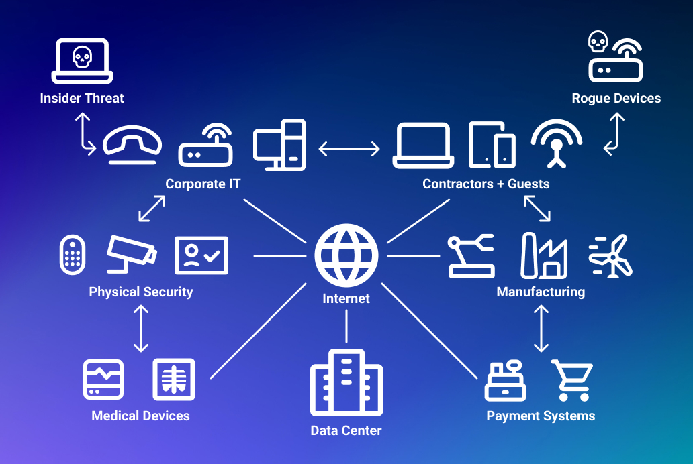

## Building Reliable Systems That Interact With the Real World

My interest in software engineering is centered on autonomous systems and highly robust IoT devices, particularly those that must operate reliably in real-world and safety-critical environments. I am most engaged when software is not abstracted away from physical constraints, but instead directly interfaces with hardware, sensors, networks, and unpredictable operating conditions. This focus has led me toward embedded systems development, where correctness, reliability, and fault tolerance are often more important than speed of iteration or convenience.

Through projects such as autonomous fixed-wing flight control, embedded IoT devices, and self-hosted server infrastructure, I have found that I value owning systems end to end. I enjoy being responsible for the entire lifecycle of a project, from initial design decisions through implementation, testing, deployment, and long-term maintenance. Working with platforms such as Arduino- and ESP32-based systems has reinforced my interest in embedded development, particularly in contexts where software must continue functioning correctly despite limited resources, environmental noise, or partial failures.

Looking forward, I hope to further develop skills related to building highly reliable and resilient systems. This includes deeper experience with embedded networking, real-time constraints, failure detection, and recovery strategies for autonomous and distributed devices. I am also interested in improving my ability to design software architectures that scale from a single embedded controller to a larger system of interconnected devices, while still maintaining clarity, safety, and maintainability.

Ultimately, my goal is to become a software engineer capable of designing and maintaining systems that people can trust in real-world conditions. Whether working on autonomous platforms, embedded IoT infrastructure, or safety-critical control software, I am motivated by projects that demand careful engineering, long-term thinking, and accountability for system behavior beyond the code itself. These interests guide both my personal projects and my preparation for industry, where robust and well-engineered systems are essential.

