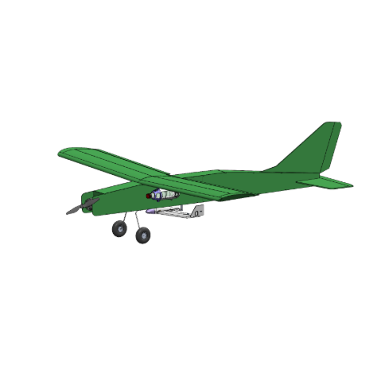

## AIAA Fixed-Wing Drone Project — Junior Project (x96)

For my x96 Junior Project at the University of Hawaiʻi at Mānoa, I served as the **lead software developer** for the AIAA fixed-wing drone team. My primary responsibility was the development and integration of autonomous flight logic using ArduPilot, with a focus on reliability, repeatability, and safe operation during flight testing and deployment scenarios.

A significant portion of my work involved **automating the aircraft’s landing path**, including tuning guidance and control parameters to ensure consistent and accurate autonomous landings. In addition, I designed and implemented software support for the **release mechanism** that separates the drone from the main glider, coordinating timing, control logic, and safety constraints to ensure a clean and predictable release during flight operations.

Throughout the semester, I delivered **multiple technical presentations** documenting progress, challenges, and system performance to faculty and peers. I also participated in numerous **field testing days**, where I collaborated closely with other team members to tune flight parameters, validate system behavior, and iterate on software changes based on real-world performance data.

---

### Team and Field Testing

*Figure 1: AIAA Fixed-Wing Drone Project team during a field testing session.*

---

### Autonomous Flight Path

*Figure 2: ArduPilot visualization of the fixed-wing aircraft’s autonomous flight and landing path.*

