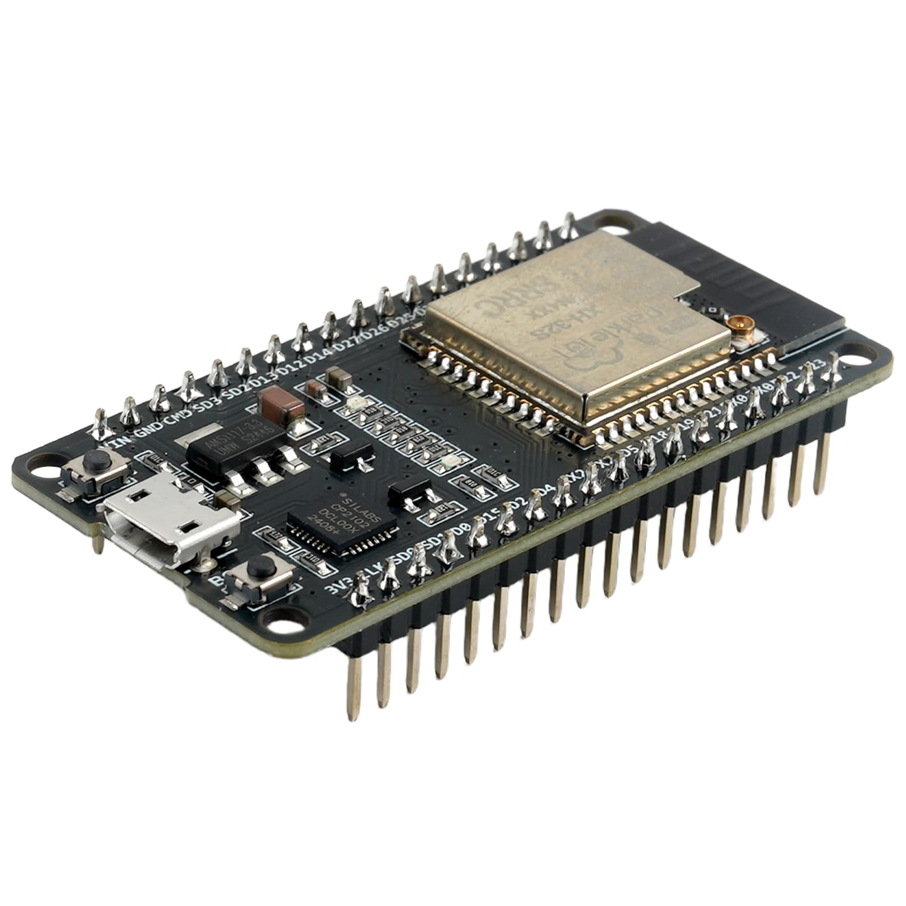
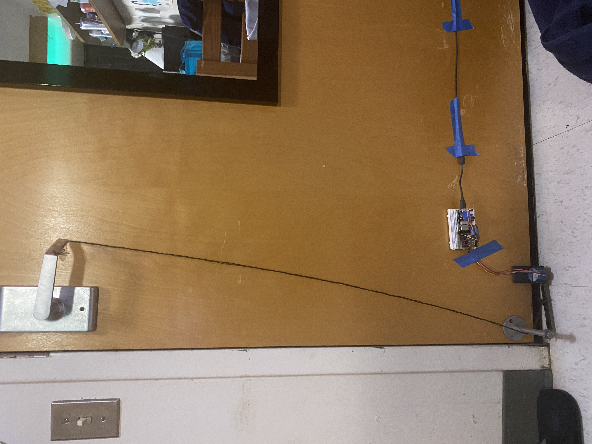

## Remote Dorm Room Door Opener — Embedded Systems Project

I designed and built a device that allowed me to **open my dorm room door from the outside** using a network-connected embedded system. The core of the system was an **ESP32 microcontroller** running a lightweight web server, which enabled authenticated access when connected to the local Wi-Fi network. Through this web interface, I could securely trigger the door-opening mechanism remotely.

When activated, the system drove a mechanical arm that swung underneath the door. This arm was connected to a rope mechanism, which applied the necessary force to pull the door open from the outside. The project required careful coordination between embedded software, motor control, and mechanical design to ensure reliable operation within the constraints of a dorm room environment.

To support the mechanical aspects of the system, I used **Autodesk Inventor** to design custom mounting brackets and structural components. These parts were **3D printed** and iteratively refined to achieve proper alignment, strength, and ease of installation. The final system combined embedded networking, mechanical actuation, and rapid prototyping into a functional and practical solution.

---

### Design
 

*An ESP32 microcontroller*

---

### Hardware
  

*Installed door-opening device showing the ESP32-controlled actuator and mounting hardware.*

Here is my code I used: https://github.com/zacklown/door-opener.
